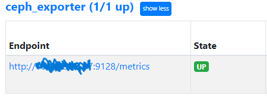
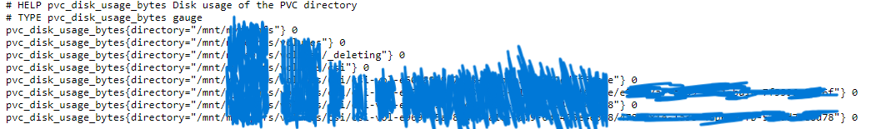

# Ceph Exporter
Aplikasi ini berfungsi untuk mengeluarkan metrics dari penggunaan suatu direktori (direktori usage). Dalam case ini author menggunakan aplikasi ini untuk melihat usage suatu direktori mounting filesystem dari Ceph.

## 1. Source
- [File installer Golang](https://go.dev/dl/)
- [Cara install Golang di Ubuntu](https://www.digitalocean.com/community/tutorials/how-to-install-go-on-ubuntu-20-04)

## 2. Prequisite
- Golang environment yang telah disetup
- Prometheus yang telah disetup
- Docker yang terinstall
- Container Registry (DockerHub, Gitlab Container Registry, Harbor, dsb)

## 3. Buid image
Untuk memudahkan dalam menjalankan aplikasi ini, author menggunakan Docker container. Hal ini agar saat melakukan running aplikasi bisa dapat dengan mudah memasukkan environment variable, environment variable yang dimasukkan yakni direktori yang akan dikeluarkan metricsya via prometheus source.

```bash
docker build -t <repository>/ceph_exporter:<tag> .

# masuk ke container registry
docker login -u <registry_username> -p <registry_password> <registry_link>
docker push <repository>/ceph_exporter:<tag>
```

## 4. Running Container
Jalankan container dengan single command pada vm/server dimana tempat direktori mnt akan dimonitoring usagenya.

```bash
docker run -d --name ceph_exporter -v <mount/dir/path>:<mount/dir/path> -p 9128:9128 -e PVC_BASE_DIRECTORY=<mount/dir/path> <repository>/ceph_exporter:<tag>

contoh :
docker run -d --name ceph_exporter -v /mnt/my_dir:/mnt/my_dir -p 9128:9128 -e PVC_BASE_DIRECTORY=/mnt/my_dir balamaru/ceph-exporter
```

Pastikan container berjalan, dengan command :
```bash
docker ps

output :
CONTAINER ID   IMAGE                    COMMAND            CREATED          STATUS          PORTS                                       NAMES
7cc811d422ce   balamaru/ceph-exporter   "/ceph_exporter"   28 seconds ago   Up 27 seconds   0.0.0.0:9128->9128/tcp, :::9128->9128/tcp   ceph_exporter
```

## 5. Update Prometheus agar dapat listen metrics dari exporter
Untuk menambahkan metric exporter dapat melakukan update job pada file prometheus.yaml. By default file prometehus.yaml dapat ditemukan di /etc/prometehus/prometheus.yaml.

```yaml
# tambahkan job baru pada scrape_configs

scrape_configs:
    ...
    ...
    ...
  - job_name: "ceph_exporter"
    static_configs:
      - targets: ["<ip_public_server>:9128"]
```
Lakukan restart pada prometheus

```bash
sudo systemctl restart prometheus
```
Akses ke prometheus dan lihat pada target, seharusnya sudah ada job baru yang muncul :
<p align="center">  </p>

Dan jika dilihat pada metricnya, akan muncul metric baru. Dimana semua dorektori di dalam /mnt/my_dir/ tereskpos :
<p align="center">  </p>